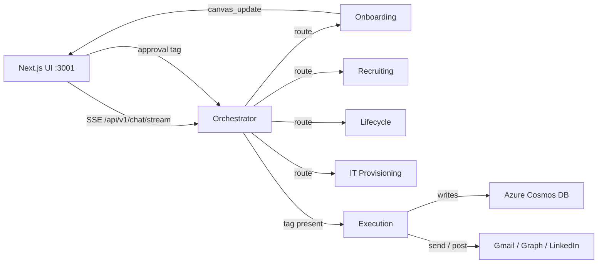

# HR Copilot — Master Implementation Roadmap

Hyper-detailed, checkable roadmap for the remaining phases. Each task is scoped to specific
files, Python tool names, frontend components, and state-transition tags so sections can be
fed back into Cursor and executed sequentially.

---

## Architectural Baseline (as-built)

- Topology: Next.js UI on `:3001` (JWT `AuthGate` + Side Canvas HITL) → FastAPI `:8000` via SSE.
  - Next rewrite: `/api/v1/:path*` → `http://localhost:8000/api/v1/:path*` in [frontend/next.config.mjs](frontend/next.config.mjs).
  - SSE client: [frontend/src/lib/sse.ts](frontend/src/lib/sse.ts); canvas routing in [frontend/src/lib/chat-store.ts](frontend/src/lib/chat-store.ts) (`applyCanvasUpdate`).
- Agent orchestration:
  - [backend/agents/orchestrator.py](backend/agents/orchestrator.py) routes (keyword, then LLM transfer tools); never mutates.
  - Workers: [backend/agents/onboarding.py](backend/agents/onboarding.py), [backend/agents/recruiting.py](backend/agents/recruiting.py), [backend/agents/lifecycle.py](backend/agents/lifecycle.py), [backend/agents/it_provisioning.py](backend/agents/it_provisioning.py).
  - [backend/agents/execution.py](backend/agents/execution.py) is the only writer; gated on the latest user message via `approval_kind()` / `has_approval_tag()` in [backend/agents/runtime.py](backend/agents/runtime.py).
- State-transition tags: `[PROVISIONING APPROVED]` (provisioning), `[APPROVED TO SEND]` (send), `[UPDATE APPROVED]` (update).
- Working features:
  - Onboarding: 5-part packet in [backend/tools/onboarding_tools.py](backend/tools/onboarding_tools.py) (`prepare_onboarding_packet`), 3 Gmail dispatches, Cosmos checklist init.
  - WA compliance in [backend/tools/compliance_validator.py](backend/tools/compliance_validator.py): RCW 49.58 (equal-pay ranges) + RCW 49.62 (`RCW_4962_W2_MIN = 126_858.83`, `RCW_4962_CONTRACTOR_MIN = 317_147.09`).
- Known gaps: local `backend/mcp/` shadows the official `mcp` SDK; MSAL/Graph Teams execution incomplete; checklist booleans never flip to `true`; Lifecycle/Recruiting lack full execution wiring.

---

## Phase 1: Architectural Polish & Bug Fixes

### 1.1 Resolve FastMCP shadowing (rename `backend/mcp` → `backend/integrations`)

The local package `backend/mcp/` collides with the pip `mcp` SDK, so `fastmcp` fails to import
`mcp.types` and the `/mcp` HTTP mount silently degrades to the in-process fallback in
[backend/mcp/server.py](backend/mcp/server.py).

- [x] Create new package `backend/integrations/` and move files (`Move-Item backend/mcp backend/integrations`, pycache dropped):
  - [x] `backend/mcp/__init__.py` → `backend/integrations/__init__.py`
  - [x] `backend/mcp/server.py` → `backend/integrations/server.py`
  - [x] `backend/mcp/gmail_tools.py` → `backend/integrations/gmail_tools.py`
  - [x] `backend/mcp/graph_tools.py` → `backend/integrations/graph_tools.py`
  - [x] `backend/mcp/linkedin_tools.py` → `backend/integrations/linkedin_tools.py`
- [x] Update the only project-owned import sites (venv SDK references must NOT change):
  - [x] [backend/main.py](backend/main.py): `from integrations.gmail_tools import gmail_send`; `from integrations.server import get_mcp_http_app`.
  - [x] [backend/agents/execution.py](backend/agents/execution.py): `from integrations.gmail_tools import gmail_send`.
  - [x] `backend/integrations/server.py` internal `from . import gmail_tools, graph_tools, linkedin_tools` stays (relative).
- [x] Keep the local decorator variable name `mcp` inside `server.py` as an instance of `fastmcp.FastMCP` (variable, not a package import — fine after rename).
- [x] Updated the shadow-guard warning text; verified `from fastmcp import FastMCP` succeeds and `get_mcp_http_app()` returns a real app (`FASTMCP_AVAILABLE = True`).
- [x] In [backend/main.py](backend/main.py), `app.mount("/mcp", _mcp_http)` now mounts the true FastMCP HTTP app (route path unchanged for clients).
- [x] Grep guard: no project hits for `from mcp.` / `import mcp` outside `.venv`.
- [x] Import test: `python -c "import main"` succeeds with no `ModuleNotFoundError: No module named 'mcp.types'`.
- [ ] Optional cleanliness: drop `mcp>=1.0.0` direct pin in [backend/requirements.txt](backend/requirements.txt) if only pulled transitively by `fastmcp` (left as-is; harmless, satisfied by `mcp 1.29.0`).

### 1.2 MSAL auth finalization (OBO + Graph token storage)

- [x] Audited MSAL helpers in [backend/core/auth/msal_auth.py](backend/core/auth/msal_auth.py): `build_auth_url`, `exchange_auth_code`, `acquire_obo_token`, `refresh_with_refresh_token`, `token_payload_for_cosmos` (all present).
- [x] Callback [backend/api/v1/microsoft.py](backend/api/v1/microsoft.py) persists tokens via `upsert_integration_tokens(user_id, "microsoft_graph", ...)` (doc id `"{user_id}:microsoft_graph"`), matching the Gmail token shape.
- [x] Hardened `_graph_token(user_id, force_refresh=False)` in [backend/integrations/graph_tools.py](backend/integrations/graph_tools.py): proactive expiry check (`expires_at` + 120s skew) plus a `_graph_request` wrapper that force-refreshes and retries once on HTTP 401; clear "not connected" error when no token/refresh.
- [x] `token_payload_for_cosmos` now records `obtained_at`/`expires_at` to enable proactive refresh.
- [x] OBO wiring: `POST /api/v1/auth/microsoft/obo` (JWT-guarded) exchanges a frontend MS user assertion via `acquire_obo_token` and stores it under the app `user_id`. Added `graph_post_chat_message` (Chat.Send) for Phase 3 reuse.
- [x] Threaded the app JWT through `/microsoft/login?token=` → state map → callback so Graph tokens store under the same `user_id` the execution layer uses (`_graph_token(user_id)`).
- [x] Added `MSAL_GRAPH_SCOPES` to [backend/.env.example](backend/.env.example) (other MSAL keys already documented).
- [x] Tools page: added a "Connect Microsoft" card + `GET /api/v1/auth/microsoft/status`, provider-aware success/error toasts in [frontend/src/components/pages/tools-page.tsx](frontend/src/components/pages/tools-page.tsx).
- [ ] End-to-end token round-trip (connect → `graph_send_mail` dry run) pending real MSAL app credentials in `.env`.

---

## Phase 2: Closing the Loop on Stateful Checklists

Current schema (init only, all `false`) is written by `init_onboarding_checklist` in
[backend/tools/azure_cosmos.py](backend/tools/azure_cosmos.py), partitioned by `/employeeId`, with flags:
`background_check`, `profile_setup`, `email_setup`, `i9_signed`, `nda_signed`, `emergency_contact`, `training_checklist`.

### 2.1 Backend: dynamic checklist updates

- [x] Added `update_onboarding_checklist(employee_id, updates) -> Optional[dict]` in [backend/tools/azure_cosmos.py](backend/tools/azure_cosmos.py):
  - [x] Reads via `get_onboarding_checklist`, whitelists to `CHECKLIST_BOOL_FLAGS`, coerces to `bool`.
  - [x] `_recompute_checklist_status` sets `complete`/`in_progress` from required flags (respects `nda_required`).
  - [x] Sets `updated_at`, `replace_item`, returns saved doc (or `None` if not found).
- [x] `_CHECKLIST_PROTECTED` guards `id`, `employeeId`, `_rid`, `_etag`, `created_at`, etc. from overwrite.

### 2.2 Backend: PATCH route

- [x] Added `PATCH /onboarding/checklists/{employee_id}` in [backend/api/v1/onboarding.py](backend/api/v1/onboarding.py) with a `ChecklistPatch` body (`updates: Dict[str, bool]`), `verify_jwt`, 404 on missing doc.
- [x] Imports `update_onboarding_checklist`; router already mounted under `/api/v1` in [backend/main.py](backend/main.py).

### 2.3 Frontend: manual toggle in `OnboardingTracker.tsx`

- [x] In [frontend/src/components/copilot/modules/OnboardingTracker.tsx](frontend/src/components/copilot/modules/OnboardingTracker.tsx), each step is now a clickable button:
  - [x] `toggle(key, current)` → optimistic local flip, then `PATCH /api/v1/onboarding/checklists/{empId}` with `{ updates: { [key]: next } }` via `authHeaders()`.
  - [x] On success, replaces `remote` with the response doc; on failure, sets error + reloads authoritative state. Per-item spinner via `savingKey`.
  - [x] Toggles disabled when `empId` is empty (preview-only) or a save is in flight.
- [x] Preserved the progress bar (`doneCount/steps.length`) and `stepsFromDoc` mapping.

### 2.4 Automated webhooks (future-proof placeholder)

- [x] New router [backend/api/v1/webhooks.py](backend/api/v1/webhooks.py): `POST /webhooks/document-signed` (no JWT; verifies `X-Webhook-Token` against `WEBHOOK_SHARED_SECRET`).
- [x] Maps `{employee_id, document_type}` → flag (`i9`/`i-9` → `i9_signed`, `nda`/`non_compete` → `nda_signed`, `emergency` → `emergency_contact`) and calls `update_onboarding_checklist`.
- [x] Registered in [backend/main.py](backend/main.py) under `/api/v1` (`webhooks_router`). Added `WEBHOOK_SHARED_SECRET` to [backend/.env.example](backend/.env.example). Blob Storage `BlobCreated` event-grid shape remains a TODO alternative.

---

## Phase 3: IT Provisioning (Mock Round-Trip)

> DECISION: A separate team owns the real ticketing system. To avoid coupling to an unfinished
> external dependency, Phase 3 ships a **mock IT ticket round-trip**: the Execution agent "dispatches"
> a ticket to a stubbed IT sink, receives a mock acknowledgement, and flips the relevant checklist
> flags. The dispatch is isolated behind a single `ITDispatcher` seam so the other team's system
> (or a real Graph/Teams `Chat.Send`) can be swapped in later with no changes to the agent or UI.

Today IT tickets are only drafted (`it_tickets` string in the onboarding packet) and shown in the
Side Canvas. This phase closes the loop with a mock dispatch + mock acknowledgement.

### 3.1 `dispatch_it_ticket` execution tool (mock sink)

- [x] Created [backend/integrations/it_dispatcher.py](backend/integrations/it_dispatcher.py) with a provider seam:
  - [x] `dispatch_it_ticket(user_id, packet) -> dict` reads env `IT_DISPATCH_MODE` (`"mock"` default, `"teams"` reserved).
  - [x] Mock mode: deterministic `ticket_id` (`IT-{emp_id}-{yyyymmdd}`), logs the body, persists `it_ticket_id`/`it_ticket_status="submitted"` on the checklist via `set_checklist_it_ticket`, returns `{ok, ticket_id, status, mode}`.
  - [x] `# TODO(real)` branch left for `mode == "teams"` (falls through to mock so provisioning never blocks).
- [x] In [backend/agents/execution.py](backend/agents/execution.py) `_run_provisioning`, after the 3 Gmail sends, calls `dispatch_it_ticket(user_id, {**packet, "employee_id": emp_id})`:
  - [x] Emits `tool_start`/`tool_end` frames named `dispatch_it_ticket` with the returned `ticket_id`.
  - [x] Body = `packet["it_tickets"]` (only dispatched when present).
  - [x] On failure, degrades gracefully: hire stays committed, `delta` note emitted, stream not crashed.

### 3.2 Mock acknowledgement + checklist flip

- [x] Added `POST /api/v1/webhooks/it-ticket-ack` in [backend/api/v1/webhooks.py](backend/api/v1/webhooks.py) (`X-Webhook-Token`) accepting `{employee_id, ticket_id?, status}`.
- [x] On `complete`, calls `update_onboarding_checklist(employee_id, {"profile_setup": True, "email_setup": True})` and sets `it_ticket_status="complete"`.
- [x] Added dev helper [backend/scripts/mock_it_ack.py](backend/scripts/mock_it_ack.py) to simulate IT closing the ticket end-to-end.
- [x] `OnboardingTracker.tsx` reflects the flipped flags on next refresh (no special-casing needed).

### 3.3 Swap-in seam for the other team (deferred)

- [x] Documented the dispatcher contract in the module docstring (input `packet`, output `{ok, ticket_id, status, mode}`) so the ticketing team can implement `mode="teams"` or an HTTP client without touching agent/UI code.
- [x] Graph `Chat.Send` fallback ready: `graph_post_chat_message(user_id, chat_id, text)` in [backend/integrations/graph_tools.py](backend/integrations/graph_tools.py) (`POST /chats/{chat_id}/messages`, `Chat.ReadWrite`) using MSAL tokens from Phase 1.2, plus `IT_TEAMS_CHAT_ID` env.

---

## Phase 4: Full Lifecycle & Internal Transfers

Lifecycle worker [backend/agents/lifecycle.py](backend/agents/lifecycle.py) currently only does
read-only `lookup_employee_record` and tells the user to reply `[UPDATE APPROVED]`.

### 4.1 `compile_transfer_packet` Python tool

- [x] Created [backend/tools/lifecycle_tools.py](backend/tools/lifecycle_tools.py) with `compile_transfer_packet(employee_query, new_department, new_manager_id, new_salary, effective_date, employment_type)`:
  - [x] Looks up the record via `lookup_employee`.
  - [x] Computes `salary_delta`, `pct_change`, old/new department + manager.
  - [x] Drafts a deterministic transfer memo via `_render_transfer_memo` (no LLM copy).
  - [x] Returns `status: awaiting_approval` + `changes`/`compliance` blocks; stashes via `stash_transfer`/`get_stashed_transfer` (mirrors the onboarding stash).
- [x] Added `compile_transfer_packet` tool schema to the Lifecycle worker ([backend/agents/lifecycle.py](backend/agents/lifecycle.py)); streams a `LIFECYCLE_TRANSFER` `canvas_update`.

### 4.2 Compliance re-check on promotion (RCW 49.62)

- [x] `compile_transfer_packet` calls `noncompete_allowed()` for both the old and new salary.
- [x] When previously below threshold and now at/above `126_858.83` (W-2) / `317_147.09` (contractor), sets `nda_addendum_required = true` and attaches the `nda` SAS link via `resolve_onboarding_doc_urls` in [backend/tools/azure_blob.py](backend/tools/azure_blob.py).
- [x] The `LifecycleTransfer` canvas module surfaces the RCW reason + addendum warning for HITL review.

### 4.3 Execution path for `[UPDATE APPROVED]`

- [x] [backend/agents/execution.py](backend/agents/execution.py) `kind == "update"` now prefers the stashed transfer packet (`_run_transfer_update`) before the LLM fallback.
- [x] Cosmos writes update `department`, `managerId` (+ `manager`), `annualSalary` (+ `salary`) via `update_employee_field`, emitting per-field tool frames.
- [x] When `nda_addendum_required`, emails the NDA/non-compete addendum (Gmail) with the SAS link.
- [x] Emits a final `delta` summary of the applied field changes.

---

## Phase 5: Recruiting & Interview Scheduling

Recruiting worker [backend/agents/recruiting.py](backend/agents/recruiting.py) drafts compliant
postings via `posting_from_band`/`validate_salary_range_text` in
[backend/tools/compliance_validator.py](backend/tools/compliance_validator.py). LinkedIn tool is a
scaffold in `linkedin_tools.py` (`linkedin_post_job`).

### 5.1 LinkedIn MCP execution

- [x] Finalized [backend/integrations/linkedin_tools.py](backend/integrations/linkedin_tools.py): `linkedin_publish_posting(user_id, posting)` reads a member token from Cosmos `integrations` (`"{user_id}:linkedin"`) and posts, degrading gracefully (ok:false) when unconnected.
- [x] Added a `[POSTING APPROVED]` tag to `APPROVAL_TAGS`/`approval_kind` in [backend/agents/runtime.py](backend/agents/runtime.py) → routes to Execution (`kind == "posting"`). Recruiting stashes the posting via `stash_posting`.
- [x] Compliance enforced at publish time: `validate_salary_range_text` must pass and a benefits summary must be present (RCW 49.58).
- [ ] LinkedIn OAuth `.env` keys + Tools-page connect card deferred (token slot in Cosmos is ready; publish path degrades gracefully until connected).

### 5.2 Candidate resume ingestion + matrix

- [x] Added `save_resume_to_blob(file_bytes, filename, requisition_id)` in [backend/tools/azure_blob.py](backend/tools/azure_blob.py) writing to `candidates/{requisition_id}/`.
- [x] Added `parse_resume_against_requisition(...)` + `score_resume(...)` in [backend/tools/recruiting_tools.py](backend/tools/recruiting_tools.py): tokenizes text, scores against required skills, returns a ranked candidate matrix.
- [x] Recruiting worker gained a `screen_resume` tool that pulls the uploaded resume text (`<Attached_Document>`), saves it to Blob, and streams a `RESUME_SCREENING` `canvas_update` (module already exists in [frontend/src/components/canvas-modules.tsx](frontend/src/components/canvas-modules.tsx)).
- [x] [backend/api/chat.py](backend/api/chat.py) already extracts `UploadFile` text into the prompt, which the recruiting `screen_resume` path consumes.

---

## Phase 6: Frontend Polish & Error Resilience

### 6.1 Stream resilience

- [x] Added a React error boundary at [frontend/src/components/error-boundary.tsx](frontend/src/components/error-boundary.tsx) (class component with reset + custom fallback support).
- [x] Wrapped the chat surface and Side Canvas separately in [frontend/src/components/chat-area.tsx](frontend/src/components/chat-area.tsx) so a crash in one pane doesn't blank the console.
- [x] `isRunning` already resets in the `chat-store.ts` settle/`finally` path; the boundary provides the retryable affordance for render/SSE failures.
- [x] Confirmed the backend always terminates with a `done` frame ([backend/api/chat.py](backend/api/chat.py) `generate()` finally-block).

### 6.2 UX/UI improvements (deep packet review)

- [x] Replaced the stacked read-only textareas in [frontend/src/components/copilot/modules/OnboardingWorkflow.tsx](frontend/src/components/copilot/modules/OnboardingWorkflow.tsx) with a `shadcn/ui` Accordion (`type="multiple"`) over `email_1_welcome`, `email_2_action`, `email_3_roadmap`, `it_tickets` (email 1 open by default).
  - [x] Uses existing [frontend/src/components/ui/accordion.tsx](frontend/src/components/ui/accordion.tsx).
- [x] Kept the sticky "Confirm & Provision" bar and the `[PROVISIONING APPROVED]` submit message unchanged.
- [x] Added per-draft copy-to-clipboard. (NDA inclusion/omission is already surfaced by the packet's document links + Email 2 subtitle; a dedicated badge can be added if desired.)

---

## Cross-Cutting: Verification & Guardrails

- [ ] After each phase: `python main.py` boot check + `GET /health`.
- [ ] Preserve HITL invariant — Execution only on the tag in the latest user message (`has_approval_tag` in [backend/agents/runtime.py](backend/agents/runtime.py)); never scan assistant text/history.
- [ ] Keep all worker email/document copy deterministic (Python-generated), never LLM-authored.
- [ ] Keep tool-iteration caps (`MAX_TOOL_ITERATIONS`) and fail-soft tool returns (`{"error": ...}`).
- [ ] Update [backend/scripts/seed_data.py](backend/scripts/seed_data.py) seed checklist docs whenever the flag schema changes.
